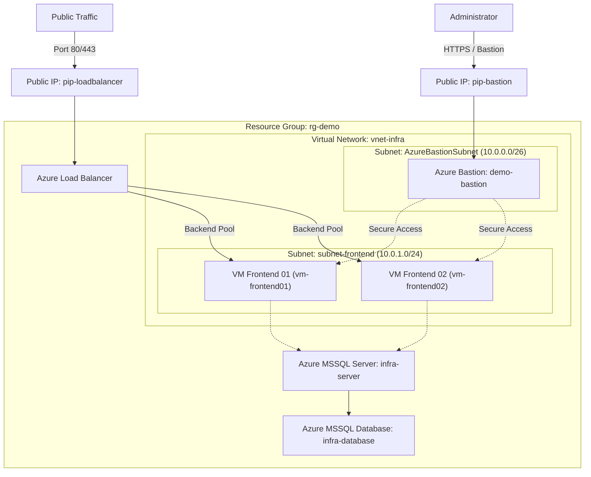

# Azure Load Balancer Infrastructure

Modular Infrastructure as Code (IaC) powered by **Terraform** to deploy a scalable, highly available **Azure Load Balancer** architecture along with networking, compute, secure remote access, and database tiers.


---

## 📌 Table of Contents

- [Overview](#-overview)
- [Architecture](#-architecture)
- [Project Structure](#-project-structure)
- [Modules Overview](#-modules-overview)
- [Prerequisites](#-prerequisites)
- [Deployment Guide](#-deployment-guide)
- [Cleanup](#-cleanup)
- [Author](#-author)

---

## 🎯 Overview

This project provides end-to-end automated deployment of an Azure environment designed for high availability and security. It separates infrastructure concerns into reusable Terraform modules, enabling easy environment replication and lifecycle management.

### Key Capabilities

- **Traffic Load Balancing**: Azure Public Load Balancer distributing incoming web requests across backend frontend virtual machines.
- **Secure Remote Access**: Azure Bastion Host deployed into a dedicated subnet (`AzureBastionSubnet`) for secure SSH/RDP access without exposing public IPs on VMs.
- **Segmented Networking**: Dedicated Azure Virtual Network (`vnet-infra`) with custom frontend and bastion subnets.
- **Database Tier**: Managed Azure MSSQL Server and MSSQL Database provisioning.
- **Modular IaC Design**: 10 decoupled Terraform modules for granular resource management and reusability.

---

## 🏗️ Architecture



---

## 📁 Project Structure

```text
Azurerm_Loadbalancer/
├── Environment/                    # Target deployment environment
│   ├── main.tf                     # Environment module invocations & orchestration
│   └── provider.tf                 # Terraform required version & AzureRM provider configuration
│
└── Module/                         # Reusable infrastructure modules
    ├── azurerm_resource_group/     # Azure Resource Group module
    ├── azurerm_virtual_network/    # Virtual Network module
    ├── azurerm_subnet/             # Subnet module
    ├── azurerm_public_ip/          # Public IP module
    ├── azurerm_loadbalancer/       # Azure Load Balancer module
    ├── azurerm_lb_association/     # NIC to Load Balancer backend pool association
    ├── azurerm_virtual_machine/    # Virtual Machine, NIC, and NSG module
    ├── azurerm_bastion/            # Azure Bastion Host module
    ├── azurerm_mssql_server/       # MSSQL Server module
    └── azurerm_mssql_database/     # MSSQL Database module
```

---

## 🧩 Modules Overview

| Module Directory | Description | Core Terraform Resource |
| :--- | :--- | :--- |
| `azurerm_resource_group` | Manages target resource group container | `azurerm_resource_group` |
| `azurerm_virtual_network` | Provisions isolated cloud network | `azurerm_virtual_network` |
| `azurerm_subnet` | Creates subnets for workloads and Bastion | `azurerm_subnet` |
| `azurerm_public_ip` | Allocates public IPs for Load Balancer & Bastion | `azurerm_public_ip` |
| `azurerm_loadbalancer` | Deploys Azure Load Balancer resource | `azurerm_lb` |
| `azurerm_lb_association` | Associates VM NICs with LB Backend Address Pool | `azurerm_network_interface_backend_address_pool_association` |
| `azurerm_virtual_machine` | Provisions Virtual Machine, NIC, and Network Security Group | `azurerm_linux_virtual_machine` / `azurerm_network_interface` |
| `azurerm_bastion` | Deploys Azure Bastion Host for secure remote access | `azurerm_bastion_host` |
| `azurerm_mssql_server` | Deploys managed SQL Server instance | `azurerm_mssql_server` |
| `azurerm_mssql_database` | Creates database on MSSQL Server | `azurerm_mssql_database` |

---

## ⚙️ Prerequisites

Before deploying this infrastructure, ensure you have:

1. **Terraform**: `v1.5.0` or higher installed.
2. **Azure CLI**: Installed and authenticated.
3. **Azure Subscription**: Active subscription with Owner or Contributor privileges.
4. **Azure Login**:
   ```bash
   az login
   az account set --subscription "YOUR_SUBSCRIPTION_ID"
   ```

---

## 🚀 Deployment Guide

### Step 1: Clone the Repository

```bash
git clone https://github.com/Pjaisw1103/Azurerm_Loadbalancer.git
cd Azurerm_Loadbalancer/Environment
```

### Step 2: Initialize Terraform

Initialize the environment directory to download provider dependencies (`hashicorp/azurerm v4.44.0`):

```bash
terraform init
```

### Step 3: Validate Configuration

Check code formatting and validate configuration syntax:

```bash
terraform fmt -recursive
terraform validate
```

### Step 4: Plan Infrastructure Deployment

Review the execution plan before creating cloud resources:

```bash
terraform plan
```

### Step 5: Provision Resources

Apply the Terraform configuration to create all resources in Azure:

```bash
terraform apply -auto-approve
```

---

## 🧹 Cleanup

To remove all provisioned Azure resources and avoid incurring unwanted charges:

```bash
cd Azurerm_Loadbalancer/Environment
terraform destroy -auto-approve
```

---

## 👤 Author

**Priya Jaiswal**
- GitHub: [@Pjaisw1103](https://github.com/Pjaisw1103)
- LinkedIn: [Priya Jaiswal](https://linkedin.com/in/priya-jaiswal1103)
